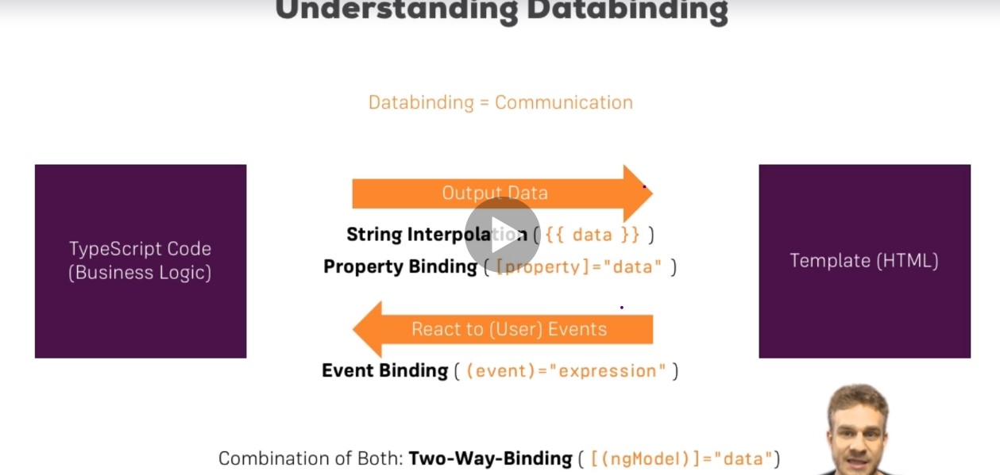

## Creating component using cli

```terminal
ng g c <component-name> --skipTests=true
```

# Data Binding

Output data from typeScript code to template



## String Interpolation

```ts
export class ServerComponent implements OnInit {
  serverId = 'Server455';
  serverStatus = 'Online';

```

```html
<p>server {{serverId}} is {{serverStatus}} now!</p>
```

## Property Binding

- We bind code into a property of html element.

```html
<button mat-raised-button color="primary" [disabled]="allowDisable">
  Add Server
</button>
```

```ts
allowDisable = true;
  constructor() {
  setTimeout(() => {
    this.allowDisable = false;
  }, 2000);}
```

- We set a property to enable/disable the button. Initially button disabled,
  after 2sec it's enables.

## Event Binding

- Binding a function/method to an event and execute that function when that event fires.

```ts
serverChangeData = 'Server not created';
onServerChange(){
    this.serverChangeData = "server created!";
  }
```

```html
<button
  mat-raised-button
  color="primary"
  [disabled]="allowDisable"
  (click)="onServerChange()"
>
  Add Server
</button>
<mat-toolbar-row>{{serverChangeData}}</mat-toolbar-row>
```

## Passing and using data with event binding

_$event_ is the data emitted with the event. To get the data, v pass $event as
an argument to the method v r calling.

```html
<form>
  <mat-form-field>
    <mat-label>Server Name: </mat-label>
    <input matInput name="server" id="server" (input)="onServerAdd($event)" />
  </mat-form-field>
  <p>{{serverName}}</p>
</form>
```

```ts
serverName = null;
  onServerAdd(eventData:any){
    this.serverName = eventData.target.value;
  }
```

- _input_ event fires and entered data is stored in _$event_. value later passed to
  _serverName_ variable.

## Two Way Binding - Using ngModel Directive

- Combination of property and event binding

  ```ts
  serverAddress = null;
  ```

  ```html
  <mat-form-field>
    <mat-label>Server Address: </mat-label>
    <input
      matInput
      name="serverAdde"
      id="serverAddr"
      [(ngModel)]="serverAddress"
    />
  </mat-form-field>
  ```

  - here data inputted is read and printed on template at same time. no need to use
    an input event neither use an $event to get event data.

---

# Directives

Directives are instructions in the DOM.

## using ngIf to output data conditionally

```ts
  serverCreated: boolean = false;
  onServerChange(){
    this.serverCreated = true;
  }

```

```html
<p *ngIf="serverCreated">
  server is created, name is {{serverName}} with address {{serverAddress}}
</p>
```

- Show paragraph element when serverCreated turns to true.

## Styling element with ngStyle directive

```html
<p [ngStyle]="{backgroundColor: checkServerStatus()}">
  server {{serverId}} is {{serverStatus}} now!
</p>
```

```ts
  checkServerStatus(){
    return this.serverStatus === 'Online' ? 'red': 'yellow'
  }
```

here v bind css style to ngStyle directive. and based on server Status, background color of p element updates.

## Outputtin list using ngFor

```html
<ul *ngFor="let item of serverArr">
  <li>{{item}}</li>
</ul>
```

```ts
serverArr = ['server1', 'server2', 'server3'];
```

---

# Components and DataBinding

## Binding to Custom properties

### Input Decorator

Binding a custom property of child component to parent component using **@Input()** decorator.

**Example:**

Child Component is _server-element component_.

**server-element.component.ts**

```ts
@Input() element: {type: string, name: string, content: string};
```

Parent component is _app component_.

**app.component.html**

```html
<app-server-element
  *ngFor="let serverElement of serverElements"
  [element]="serverElement"
></app-server-element>
```

---

## Assigning an Alias to Custom Properties
