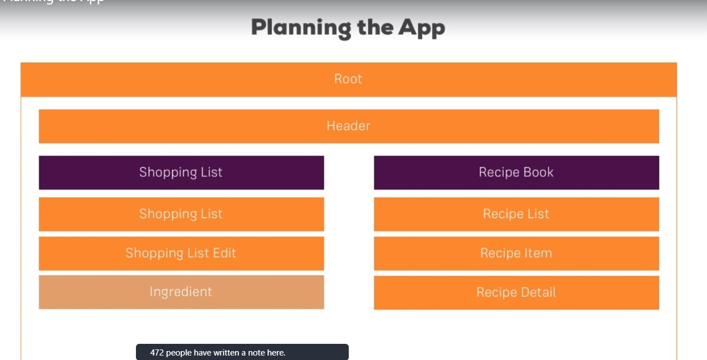

# Planning the App



# Creating Components

```terminal
ng g c header --skipTests=true
ng g c recipes --skipTests=true
ng g c recipes/recipe-list --skipTests=true
ng g c recipes/recipe-detail --skipTests=true
ng g c recipes/recipe-list/recipe-item --skipTests=true
ng g c shopping-list --skipTests=true
ng g c shopping-list/shopping-edit --skipTests=true
```

## using the component

**recipe.component.html**

```html
<div class="row">
  <div class="col-md-5">
    <app-recipe-list></app-recipe-list>
  </div>
  <div class="col-md-5">
    <app-recipe-detail></app-recipe-detail>
  </div>
</div>
```

**recipe-list.component.html**

```html
<app-recipe-item></app-recipe-item>
```

**shopping-list.component.html**

```html
<div class="row">
  <div class="col-xs-10">
    <app-shopping-edit></app-shopping-edit>
    <hr />
    <p>List goes here</p>
  </div>
</div>
```

## Adding Navigation bar

**header.component.html**

```html
<nav class="navbar navbar-expand-lg navbar-light bg-light">
  <div class="container-fluid">
    <a class="navbar-brand" href="#">Recipe Book</a>
    <button
      class="navbar-toggler"
      type="button"
      data-bs-toggle="collapse"
      data-bs-target="#navbarNavDropdown"
      aria-controls="navbarNavDropdown"
      aria-expanded="false"
      aria-label="Toggle navigation"
    >
      <span class="navbar-toggler-icon"></span>
    </button>
    <div class="collapse navbar-collapse" id="navbarNavDropdown">
      <ul class="navbar-nav">
        <li class="nav-item">
          <a class="nav-link active" aria-current="page" href="#">Recipe</a>
        </li>
        <li class="nav-item">
          <a class="nav-link" href="#">Shopping List</a>
        </li>
        <li class="nav-item dropdown">
          <a
            class="nav-link dropdown-toggle"
            href="#"
            id="navbarDropdownMenuLink"
            role="button"
            data-bs-toggle="dropdown"
            aria-expanded="false"
          >
            Manage
          </a>
          <ul class="dropdown-menu" aria-labelledby="navbarDropdownMenuLink">
            <li><a class="dropdown-item" href="#">Save</a></li>
            <li><a class="dropdown-item" href="#">Fetch</a></li>
          </ul>
        </li>
      </ul>
    </div>
  </div>
</nav>
```

## Create a recipe model

Create a recipe model in recipes component.

```bash
ng g class recipes/recipe --type=model
```

**recipe.model.ts**

```ts
export class Recipe {
  public name: string;
  public description: string;
  public imagePath: string;

  constructor(name: string, description: string, imagePath: string) {
    this.name = name;
    this.description = description;
    this.imagePath = imagePath;
  }
}
```

## Adding contents to the recipe components

**recipe-list.component.ts**

```ts
recipeList:Recipe[]= [
    new Recipe('Recipe One', 'Lorem ipsum is placeholder  ztext commonly used in the graphic, print, and publishing industries for previewing layouts and visual mockups.', '/assets/images/meat-4813261_640.jpg')
]
```

```html
<div class="card" style="width: 18rem;" *ngFor="let recipe of recipeList">
  
  <div class="card-body">
    <h5 class="card-title">{{recipe.name}}</h5>
    <p class="card-text">{{recipe.description}}</p>
  </div>
</div>
```

## Displaying Recipe Details

**recipe-details.component.html**

```html
<div class="row">
  <div class="col-xs-10">
    <h3>Recipee Name</h3>
    <div class="btn-group">
      <button
        type="button"
        class="btn btn-success dropdown-toggle"
        data-bs-toggle="dropdown"
        aria-expanded="false"
      >
        Manage
      </button>
      <ul class="dropdown-menu">
        <li><a class="dropdown-item" href="#">To Shopping List</a></li>
        <li><a class="dropdown-item" href="#">Edit Recipe</a></li>
        <li><a class="dropdown-item" href="#">Delete Recipe</a></li>
      </ul>
    </div>
  </div>
</div>
<div class="row">
  <div class="col-xs-10">
    <p class="lead">description</p>
  </div>
</div>
<div class="row">
  <div class="col-xs-10">
    <p class="lead">ingredients</p>
  </div>
</div>
```

## Working on shopping-list component and Creating ingredient model

Create a shared folder in root folder of app. later create ingredients model in that folder

```bash
ng g class shared/ingredients --type=class
```

**ingredient.model.ts**

```ts
export class Ingredients {
  constructor(public name: string, public amount: number) {}
}
```

**shopping-list.component.html**

```html
<ul class="list-group">
  <li
    class="list-group-item d-flex justify-content-between align-items-center"
    *ngFor="let ingredient of ingredientList"
  >
    {{ingredient.name}}
    <span class="badge bg-primary rounded-pill">{{ingredient.amount}}</span>
  </li>
</ul>
```

## Adding a shopping list edit section

**shopping-edit.component.html**

```html
<div class="row">
  <div class="col-md-10">
    <form>
      <div class="container">
        <div>
          <label for="name" class="form-label">Name</label>
          <input type="text" name="name" id="name" class="form-control" />
        </div>
        <div>
          <label for="amount" class="form-label">Amount</label>
          <input type="text" name="amount" id="amount" class="form-control" />
        </div>
      </div>

      <div class="mt-3 ml-3">
        <button class="btn btn-success mr-3">Add</button>
        <button class="btn btn-danger mr-3">Delete</button>
        <button class="btn btn-primary">Clear</button>
      </div>
    </form>
  </div>
</div>
```

**shopping-edit.component.scss**

```scss
.container {
  display: flex;
  justify-content: space-around;
  align-items: center;
}
```

---
